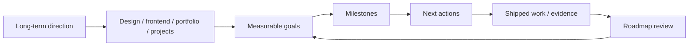
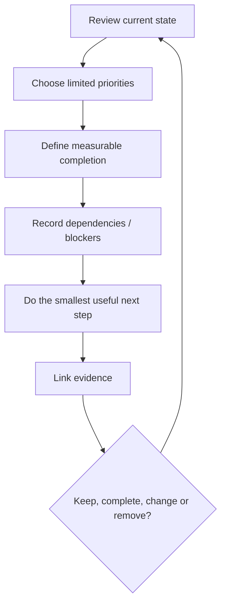
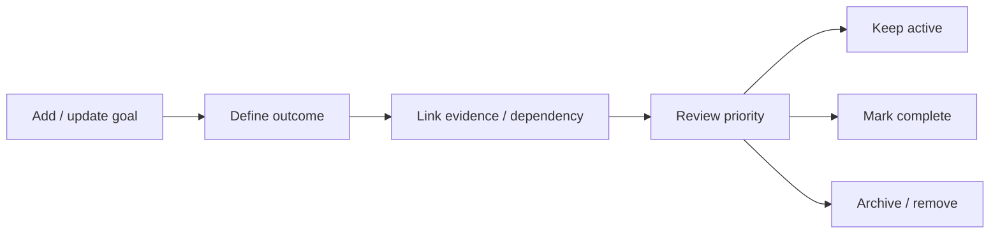

<div align="center">

# 🧭 Roadmap

**A practical planning repository for product design, frontend development, portfolio work, projects, and career growth.**


[Repository overview](./docs/REPOSITORY_OVERVIEW.md) · [Detailed docs](./docs/README.md) · [Issues](https://github.com/Nischhalsubba/Roadmap/issues)

</div>

## Overview

Roadmap is a **planning repository**, not an application. It is intended to turn broad ambitions into explicit priorities, measurable milestones, dependencies, evidence, and next actions without burying everything beneath a ceremonial backlog that nobody will ever open again.

| Audience | Use this repository for |
|---|---|
| Product designers | Skills, portfolio work, systems practice and case-study milestones |
| Frontend developers | Technical learning, implementation goals and project delivery |
| Project owners | Sequencing, dependencies, blockers and concrete outcomes |
| Career planning | Evidence-based growth goals and shipped-work tracking |

<details open>
<summary><strong>🏗️ Interactive planning architecture</strong></summary>



</details>

## Planning flow



## Repository structure

```text
Roadmap/
├── docs/
│   ├── assets/
│   ├── REPOSITORY_OVERVIEW.md
│   └── README.md
└── README.md
```

Additional planning documents can be introduced when they contain real maintained content, for example design, frontend, portfolio, backlog, resources and archive documents.

## Planning principles

- Keep current priorities separate from the long-term backlog.
- Give goals measurable completion conditions.
- Link milestones to real repositories, documents, applications or shipped outcomes.
- Record blockers and dependencies explicitly.
- Limit simultaneous priorities so the roadmap remains executable.
- Remove obsolete goals instead of preserving them as decorative guilt.
- Use dates when they improve sequencing or commitment.

## Review questions

1. What shipped since the previous review?
2. What evidence demonstrates progress?
3. Which goals are blocked, obsolete or no longer worth pursuing?
4. What is the smallest useful next deliverable?
5. Which backlog items should be removed rather than endlessly postponed?

## SEO and discoverability

This repository is naturally relevant to **product design roadmap, frontend developer roadmap, portfolio roadmap, project planning, career development roadmap, design career planning, developer growth plan, and learning milestones**. Keep titles and descriptions descriptive and specific to maintained content rather than converting the roadmap into a landfill of search keywords.

## Maintenance flow



See [`docs/README.md`](./docs/README.md) for additional repository guidance.
