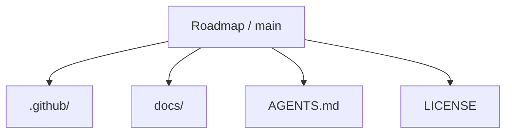
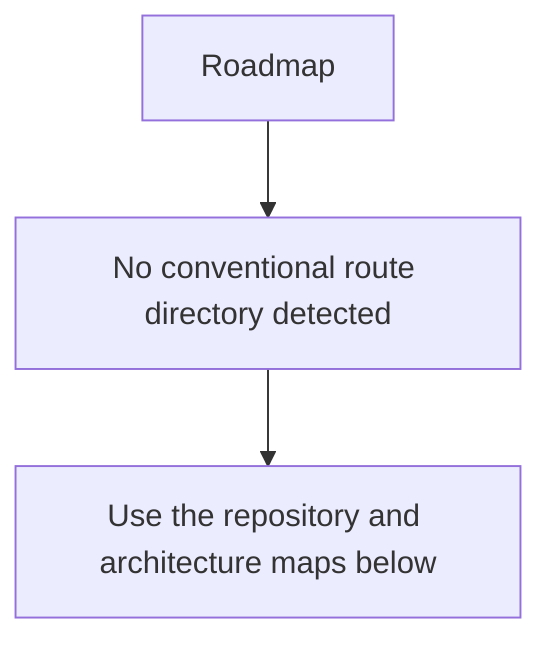
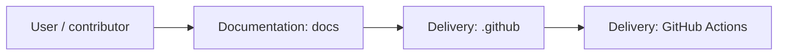
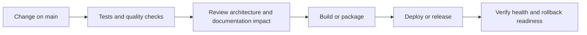
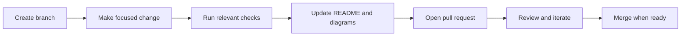

<!-- interactive-readme-standard:start -->

<div align="center">

# Roadmap

**Branch-aware technical guide for [`main`](https://github.com/Nischhalsubba/Roadmap/tree/main)**

<p>  </p>

<p>
  <a href="https://github.com/Nischhalsubba/Roadmap/tree/main"><strong>Browse source</strong></a> ·
  <a href="https://github.com/Nischhalsubba/Roadmap/issues"><strong>Issues</strong></a> ·
  <a href="https://github.com/Nischhalsubba/Roadmap/codespaces/new?ref=main"><strong>Open in Codespaces</strong></a>
</p>

</div>

> [!IMPORTANT]
> This guide is generated from the files actually present on `main`. It links to detected source paths, preserves project-authored notes, and avoids claiming components that were not found.

## At a glance

| Item | Detected value |
|---|---|
| Purpose | Branch-specific project documentation generated from the repository structure without inventing missing capabilities. |
| Branch role | Default branch |
| Stack | No primary framework detected automatically |
| Manifests | No standard manifest detected |
| Prerequisites | Confirm from the detected manifests |
| Delivery | GitHub Actions |
| License | LICENSE |

## Branch scope

This is the repository's default branch.


## Quick start

> No reliable setup command was detected. Use the preserved project-authored notes and manifests rather than guessing.

### Configuration surface

- No committed environment example file was detected.

> Never commit secrets, private keys, production credentials, customer data, or unredacted infrastructure details.

## Repository map



| Responsibility | Detected source paths |
|---|---|
| Documentation | [`docs`](https://github.com/Nischhalsubba/Roadmap/tree/main/docs) |
| Delivery | [`.github`](https://github.com/Nischhalsubba/Roadmap/tree/main/.github) |

## Website or application map



## Architecture and responsibility flow




## Quality, security, and operations

<table>
<tr>
<td width="33%" valign="top">

### Quality

- No conventional test directory was detected automatically.

Detected commands:
- No standard quality command detected.

</td>
<td width="33%" valign="top">

### Security

- No dedicated security policy or automated dependency configuration was detected.

Review authentication, authorization, input validation, dependency updates, secret handling, and failure recovery before release.

</td>
<td width="34%" valign="top">

### Observability

- No dedicated observability integration was detected automatically.

Define useful logs, metrics, traces, alerts, and rollback signals for production-facing branches.

</td>
</tr>
</table>

## Delivery flow



### Automation detected

- [`.github/workflows/apply-interactive-readme.yml`](https://github.com/Nischhalsubba/Roadmap/blob/main/.github/workflows/apply-interactive-readme.yml)

## Contribution flow



- Keep changes focused and explain architectural consequences.
- Run the checks relevant to the changed area.
- Update diagrams whenever routes, modules, data models, authentication, jobs, or delivery paths change.
- Add screenshots or recordings for visual behavior changes when useful.
- Use issues for reproducible defects and pull requests for reviewable changes.

## Ownership and support

| Topic | Source |
|---|---|
| Repository | [`Nischhalsubba/Roadmap`](https://github.com/Nischhalsubba/Roadmap) |
| Branch | [`main`](https://github.com/Nischhalsubba/Roadmap/tree/main) |
| Ownership | No CODEOWNERS file detected |
| Contributing | Use the contribution flow above |
| Support | [Open or review issues](https://github.com/Nischhalsubba/Roadmap/issues) |
| License | [`LICENSE`](https://github.com/Nischhalsubba/Roadmap/blob/main/LICENSE) |

<details>
<summary><strong>Documentation maintenance checklist</strong></summary>

- [ ] Purpose and branch scope are accurate.
- [ ] Setup and configuration commands still work.
- [ ] Repository, application, API, data, authentication, job, and deployment diagrams match the code.
- [ ] Tests, security controls, observability, and rollback behavior are documented.
- [ ] Links point to real files on this branch.
- [ ] No secrets or private operational details are exposed.

</details>

<!-- interactive-readme-standard:end -->

<!-- project-authored-notes:start -->
<details>
<summary><strong>Project-authored notes preserved from this branch</strong></summary>

<div align="center">

# Roadmap

### Personal Learning and Project Roadmap Repository

**A lightweight roadmap repository for organizing learning goals, project ideas, frontend/design growth paths, technical topics, and future development plans.**


</div>

---

## ✨ Overview

**Roadmap** is a simple repository intended to organize future learning, project planning, and skill-development direction.

The repo is currently minimal, so this README defines a clean structure that can be expanded into a personal roadmap for design, frontend development, portfolio work, product thinking, and technical learning.

---

## 🎯 Purpose

This repository can be used to track:

- design learning goals
- frontend development topics
- project ideas
- portfolio improvement plans
- GitHub repo cleanup tasks
- interview preparation topics
- product-design growth areas

---

## 🎨 Designer’s Perspective

A roadmap is useful when it turns ambition into sequence.

For a product designer who also codes, the roadmap should connect:

- design craft
- UI systems
- frontend implementation
- case-study storytelling
- technical confidence
- career positioning

---

## 🧭 Suggested Roadmap Sections

| Area | Example Topics |
|---|---|
| Product Design | Research, UX strategy, interaction design, case studies |
| Visual Design | Typography, layout, motion, design systems |
| Frontend | HTML, CSS, JavaScript, React, accessibility |
| Portfolio | Project pages, storytelling, SEO, visuals |
| Career | Interviews, applications, freelance positioning |
| Tools | Figma, GitHub, VS Code, no-code tools, AI agents |

---

## ✅ Roadmap Checklist

- [ ] Add current goals.
- [ ] Add weekly learning plan.
- [ ] Add active projects.
- [ ] Add backlog projects.
- [ ] Add completed milestones.
- [ ] Add useful resources.
- [ ] Review and update monthly.

---

## 🗺 Suggested Structure

```text
.
├── README.md
├── design-roadmap.md
├── frontend-roadmap.md
├── portfolio-roadmap.md
├── project-backlog.md
└── resources.md
```

---

<div align="center">

A small planning repo for turning long-term growth into clear next steps.

</div>

</details>
<!-- project-authored-notes:end -->
