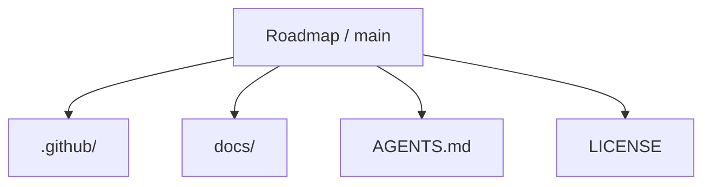
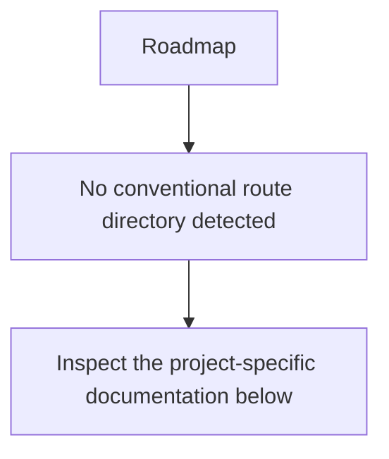
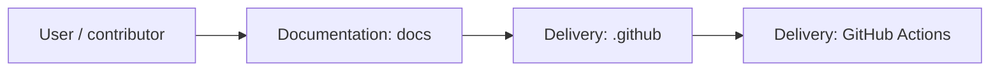
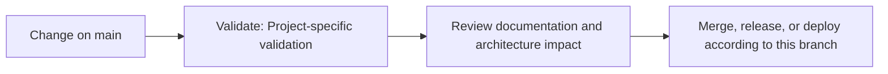

<div align="center">

# Roadmap

<!-- interactive-readme-standard:start -->

> [!NOTE]
> **Branch-specific documentation:** this section is maintained for [`main`](https://github.com/Nischhalsubba/Roadmap/tree/main). It is generated from the files present on this branch and preserves the project-authored README below.

<details open>
<summary><strong>Interactive repository guide</strong></summary>

## Branch overview

| Item | Value |
|---|---|
| Repository | [`Nischhalsubba/Roadmap`](https://github.com/Nischhalsubba/Roadmap) |
| Branch | [`main`](https://github.com/Nischhalsubba/Roadmap/tree/main) |
| Detected stack | No primary framework detected automatically |
| Detected manifests | No standard manifest detected |
| Documentation policy | Every maintained branch must explain purpose, setup, structure, architecture, flows, testing, delivery, security, and ownership. |

## Repository structure



The diagram is generated from the branch's actual top-level files and directories. Use the branch link above for complete source navigation.

## Website or application structure



## Application and responsibility flow



## Change-to-delivery flow



## README requirements for this branch

- Explain what this branch contains and how it differs from the default branch.
- Keep installation, configuration, usage, testing, deployment, security, support, and license information accurate.
- Document repository, website or application, API, data, authentication, background-job, and deployment flows when they exist.
- Prefer Mermaid diagrams and expandable `<details>` sections for visual navigation.
- Link diagrams and modules to real source paths; never invent missing components.
- Preserve project-specific documentation and update diagrams whenever architecture or major paths change.
- Treat secrets, private infrastructure, customer data, and credentials as prohibited README content.

</details>

<!-- interactive-readme-standard:end -->

### Personal Learning and Project Roadmap Repository

**A lightweight roadmap repository for organizing learning goals, project ideas, frontend/design growth paths, technical topics, and future development plans.**


</div>

---

## ✨ Overview

**Roadmap** is a simple repository intended to organize future learning, project planning, and skill-development direction.

The repo is currently minimal, so this README defines a clean structure that can be expanded into a personal roadmap for design, frontend development, portfolio work, product thinking, and technical learning.

---

## 🎯 Purpose

This repository can be used to track:

- design learning goals
- frontend development topics
- project ideas
- portfolio improvement plans
- GitHub repo cleanup tasks
- interview preparation topics
- product-design growth areas

---

## 🎨 Designer’s Perspective

A roadmap is useful when it turns ambition into sequence.

For a product designer who also codes, the roadmap should connect:

- design craft
- UI systems
- frontend implementation
- case-study storytelling
- technical confidence
- career positioning

---

## 🧭 Suggested Roadmap Sections

| Area | Example Topics |
|---|---|
| Product Design | Research, UX strategy, interaction design, case studies |
| Visual Design | Typography, layout, motion, design systems |
| Frontend | HTML, CSS, JavaScript, React, accessibility |
| Portfolio | Project pages, storytelling, SEO, visuals |
| Career | Interviews, applications, freelance positioning |
| Tools | Figma, GitHub, VS Code, no-code tools, AI agents |

---

## ✅ Roadmap Checklist

- [ ] Add current goals.
- [ ] Add weekly learning plan.
- [ ] Add active projects.
- [ ] Add backlog projects.
- [ ] Add completed milestones.
- [ ] Add useful resources.
- [ ] Review and update monthly.

---

## 🗺 Suggested Structure

```text
.
├── README.md
├── design-roadmap.md
├── frontend-roadmap.md
├── portfolio-roadmap.md
├── project-backlog.md
└── resources.md
```

---

<div align="center">

A small planning repo for turning long-term growth into clear next steps.

</div>
