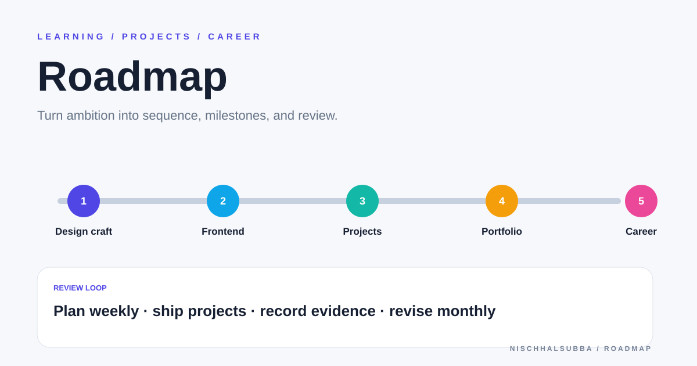

# Roadmap Repository Overview

## Classification

Public planning repository for design, frontend, portfolio, project, and career growth.

- It is documentation, not a runnable application.
- No browser screenshot is applicable.
- The visual above is a roadmap presentation asset.

## Recommended operating model

- Keep a small current-quarter plan.
- Separate active work from backlog ideas.
- Define evidence for each milestone.
- Review weekly and archive completed goals monthly.
- Link goals to real repositories, case studies, applications, or learning notes.

A roadmap that only accumulates tasks is not a roadmap. It is a museum of postponed optimism.